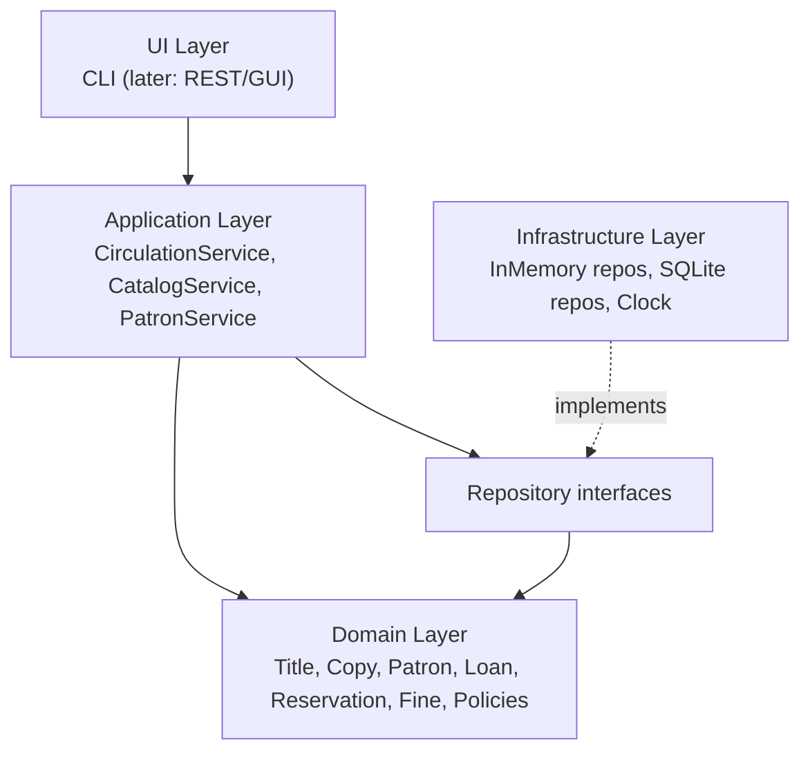
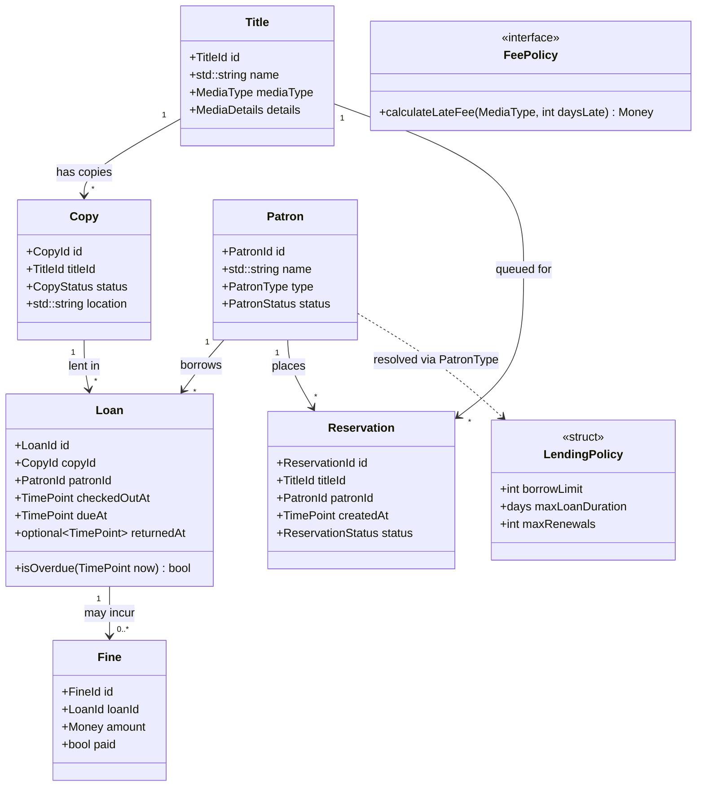
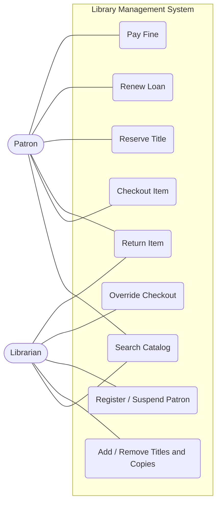
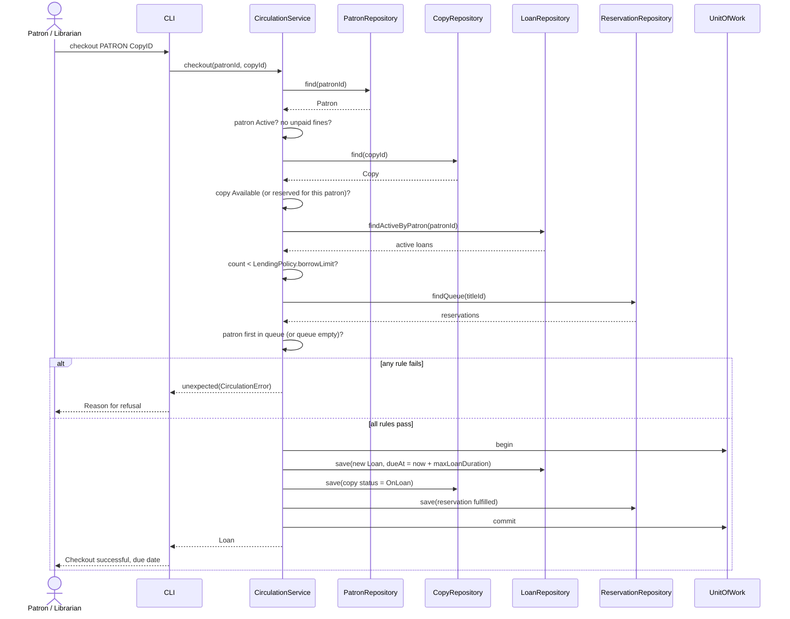
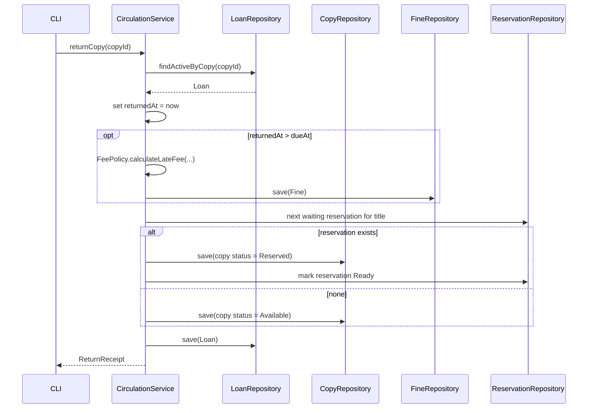
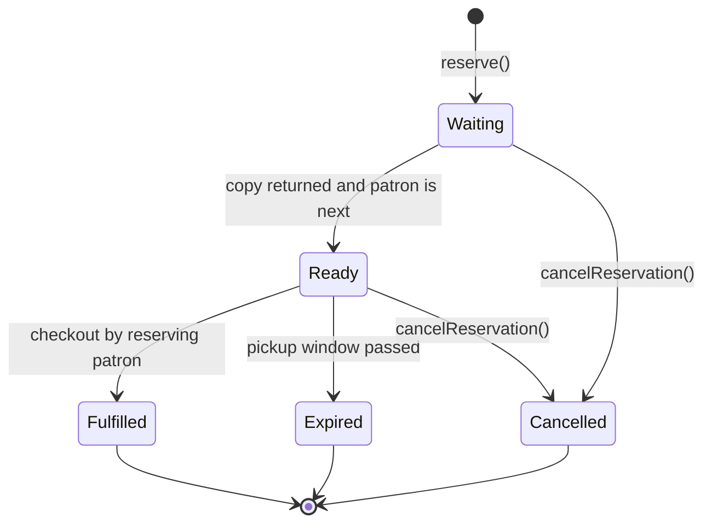

# Software Architecture Document: C++ Library Management System (v2)

This revision incorporates the review feedback on v1. The main changes are a title/copy split, an explicit `Loan` entity, policy objects instead of subclass-per-patron, a layered design replacing the `LibraryManager` god class, and explicit decisions on ownership, errors, persistence, and testing.

---

## 1. Introduction

### 1.1 Purpose
Describe the architecture of a C++ Library Management System that manages a catalog, patrons, and circulation (checkout, return, reservation, fines).

### 1.2 Scope and assumptions

| Topic | Decision |
|---|---|
| Deployment | Single-process application, CLI front end first |
| Users | Single-user at a time (no concurrent access in v1) |
| Language standard | C++20 (with `std::expected` behind a small alias for C++23 migration) |
| Persistence | In-memory repositories first, SQLite implementation second |
| Build | CMake, dependencies via vcpkg or Conan |
| Testing | GoogleTest or Catch2, with in-memory repositories as test doubles |

### 1.3 Goals
- Domain rules live in one place and are unit-testable without I/O.
- Storage and UI can be swapped without touching the domain.
- Ownership and lifetimes are explicit; no raw owning pointers.

---

## 2. Architectural Overview

A layered architecture with dependencies pointing **inward** only:



| Layer | Responsibility | Depends on |
|---|---|---|
| **Domain** | Entities, value types, policies, invariants | Standard library only |
| **Application** | Use cases; enforces business rules; coordinates repositories | Domain, repository interfaces |
| **Infrastructure** | Repository implementations, clock, ID generation | Domain, application interfaces |
| **UI** | Parsing input, rendering output | Application services only |

The UI never touches repositories, and the domain never knows about storage or I/O.

---

## 3. Domain Model

### 3.1 Key concepts

- **`Title`**: the bibliographic record (what the work is). Many copies share one title.
- **`Copy`**: a physical or digital lendable instance of a title, with its own status.
- **`Patron`**: a library member with a type that maps to a lending policy.
- **`Loan`**: a record of a copy lent to a patron, with dates.
- **`Reservation`**: a patron's place in the hold queue for a title.
- **`Fine`**: an amount owed, linked to a loan.

### 3.2 Class diagram



### 3.3 Type definitions (sketch)

```cpp
// Strong IDs prevent mixing up patron/copy/title identifiers.
template <typename Tag>
struct Id {
    std::string value;
    bool operator==(const Id&) const = default;
};
using TitleId  = Id<struct TitleTag>;
using CopyId   = Id<struct CopyTag>;
using PatronId = Id<struct PatronTag>;
using LoanId   = Id<struct LoanTag>;

enum class MediaType    { Book, Magazine, Dvd };
enum class CopyStatus   { Available, OnLoan, Reserved, Lost, Withdrawn };
enum class PatronType   { Student, Faculty, GeneralPublic };
enum class PatronStatus { Active, Suspended };

// Media-specific data as a closed set of value types, no inheritance needed.
struct BookDetails     { std::string author, isbn; Genre genre; };
struct MagazineDetails { int issueNumber; std::chrono::year_month_day published; };
struct DvdDetails      { std::string director; std::chrono::minutes runtime; };
using MediaDetails = std::variant<BookDetails, MagazineDetails, DvdDetails>;
```

`std::variant` models the closed set of media types without a class hierarchy. Fiction vs. non-fiction becomes a `Genre` field. If the set of media types is expected to grow through plugins, switch to a polymorphic `Title` hierarchy instead.

### 3.4 Policies

Patron types differ by **values**, not behavior, so they are data:

```cpp
struct LendingPolicy {
    int borrowLimit;
    std::chrono::days maxLoanDuration;
    int maxRenewals;
};

class LendingPolicyProvider {
public:
    virtual ~LendingPolicyProvider() = default;
    virtual LendingPolicy forPatronType(PatronType) const = 0;
};

class FeePolicy {
public:
    virtual ~FeePolicy() = default;
    virtual Money calculateLateFee(MediaType, int daysLate) const = 0;
};
```

Policies are injected into `CirculationService`, so rules can change without new subclasses.

---

## 4. Application Layer

### 4.1 Services

| Service | Use cases |
|---|---|
| `CatalogService` | Add/remove titles and copies, search catalog |
| `PatronService` | Register, suspend, reactivate patrons |
| `CirculationService` | Checkout, return, renew, reserve, cancel reservation, pay fine |

### 4.2 Error handling strategy

Business-rule failures are **expected outcomes**, not exceptional, so they are returned as values:

```cpp
enum class CirculationError {
    PatronNotFound, CopyNotFound, CopyNotAvailable,
    BorrowLimitReached, PatronSuspended, OutstandingFines,
    ReservedForOther, NotLoanedToPatron, RenewalLimitReached
};

template <typename T>
using Result = std::expected<T, CirculationError>;   // tl::expected on C++20
```

Exceptions are reserved for truly exceptional conditions (database corruption, out-of-memory) and are caught at the UI boundary.

### 4.3 `CirculationService` interface

```cpp
class CirculationService {
public:
    CirculationService(ItemRepositories repos,
                       const LendingPolicyProvider& lending,
                       const FeePolicy& fees,
                       const Clock& clock);

    Result<Loan>        checkout(const PatronId&, const CopyId&);
    Result<ReturnReceipt> returnCopy(const CopyId&);
    Result<Loan>        renew(const LoanId&);
    Result<Reservation> reserve(const PatronId&, const TitleId&);
    Result<void>        cancelReservation(const ReservationId&);
};
```

`ReturnReceipt` carries the closed loan, any fine generated, and the reservation (if any) that the returned copy now fulfills.

### 4.4 Business rules enforced on checkout

1. Patron exists and is `Active`.
2. Copy exists and is `Available`, or is `Reserved` for this same patron.
3. Patron has no unpaid fines above the configured threshold.
4. Active loan count is below `LendingPolicy::borrowLimit`.
5. No earlier reservation in the title's queue belongs to a different patron.

On success: create `Loan` with `dueAt = now + maxLoanDuration`, set copy to `OnLoan`, mark a matching reservation fulfilled, and persist atomically.

---

## 5. Persistence Layer

### 5.1 Repository interfaces

```cpp
class CopyRepository {
public:
    virtual ~CopyRepository() = default;
    virtual std::optional<Copy> find(const CopyId&) const = 0;
    virtual std::vector<Copy>   findByTitle(const TitleId&) const = 0;
    virtual void save(const Copy&) = 0;
};

class LoanRepository {
public:
    virtual ~LoanRepository() = default;
    virtual std::optional<Loan> findActiveByCopy(const CopyId&) const = 0;
    virtual std::vector<Loan>   findActiveByPatron(const PatronId&) const = 0;
    virtual std::vector<Loan>   findOverdue(TimePoint now) const = 0;
    virtual void save(const Loan&) = 0;
};
// TitleRepository, PatronRepository, ReservationRepository, FineRepository follow the same shape.
```

### 5.2 Design decisions

- Repositories return **value copies** (`std::optional<T>`, `std::vector<T>`), not pointers into internal storage. This removes dangling-pointer risk when records are deleted.
- Implementations own their storage (`std::unordered_map<Id, T>` in memory, SQLite rows otherwise).
- A `UnitOfWork` (or transaction scope) wraps multi-entity changes so that a checkout (loan + copy status + reservation) commits atomically.

---

## 6. Dynamic Behavior

### 6.1 Use cases



Librarian-only actions (`UC7`, `UC8`, `UC9`) require the `Librarian` role. See section 8.

### 6.2 Sequence: checkout



### 6.3 Sequence: return



### 6.4 History and audit

Past activity is derived from persisted `Loan`, `Fine`, and `Reservation` records. If a separate audit trail is needed, append immutable `LoanEvent` records (`CheckedOut`, `Returned`, `Renewed`, `FineIssued`) written by `CirculationService`. This replaces the v1 `Transaction` hierarchy: operations are service methods, and history is immutable data.

### 6.5 Reservation lifecycle



---

## 7. C++ Design Principles

| Area | Decision |
|---|---|
| **Ownership** | Repositories own data. Services hold references to repositories and policies (injected, non-owning, must outlive the service). Domain objects reference each other by **ID**, never by pointer. `std::unique_ptr` for any polymorphic object (policies, repositories). `shared_ptr` is avoided. |
| **Value semantics** | Entities are copyable value types. Rule of zero. |
| **Polymorphism** | Only where behavior varies: repositories, policies, clock. Interfaces have virtual destructors and are non-copyable. Data variation uses `enum` or `std::variant`. |
| **Const-correctness** | Query methods are `const`; getters never mutate. |
| **Time** | `std::chrono` types everywhere. A `Clock` interface is injected so tests control "now". |
| **Money** | A `Money` value type in minor units (cents) with integer arithmetic. No `double`. |
| **Errors** | `std::expected<T, CirculationError>` for rule failures; exceptions for infrastructure failures only. |
| **Compile-time safety** | Strong ID types, `enum class`, `[[nodiscard]]` on `Result`-returning functions. |

---

## 8. Security and Authorization

A minimal role model:

| Role | Permissions |
|---|---|
| `Patron` | Search, own loans, renew, reserve, pay own fines |
| `Librarian` | All patron actions on behalf of others, add/remove titles and copies, register/suspend patrons, override checkout rules |
| `Admin` | Librarian permissions plus configuration |

The UI layer authenticates the user and passes an `ActorContext` (id, role) to the services. Services check permissions before executing and return `CirculationError::NotAuthorized` when denied. Overrides are recorded as audit events.

---

## 9. Search

`CatalogService::search(const SearchQuery&)` supports filtering by title text, author, ISBN, media type, genre, and availability.

- v1: linear scan with case-insensitive substring match over `TitleRepository`.
- Later: SQLite FTS5 index behind the same repository method, with no change to callers.

---

## 10. Concurrency

v1 assumes a **single thread and single user**, so no locking is required. If a multi-user server is added later:

- Transactions move into the repository layer (SQLite transactions or a mutex per aggregate).
- The checkout rule evaluation must run inside the same transaction as the writes to avoid double-lending a copy.

---

## 11. Project Structure and Build

```
library-system/
├── CMakeLists.txt
├── cmake/                     # toolchain, warnings, sanitizers
├── vcpkg.json | conanfile.txt
├── include/lms/
│   ├── domain/                # entities, ids, policies, money
│   ├── app/                   # services, repository interfaces, errors
│   └── infra/                 # in-memory and SQLite repositories
├── src/
│   ├── domain/
│   ├── app/
│   ├── infra/
│   └── cli/                   # main(), command parsing, rendering
└── tests/
    ├── domain/
    ├── app/                   # service tests with in-memory repos
    └── infra/                 # repository contract tests
```

CMake targets: `lms_domain` (static library) ← `lms_app` ← `lms_infra`, and the `lms_cli` executable linking all three. Targets declare dependencies with `target_link_libraries(... PUBLIC/PRIVATE ...)` so the inward-only rule is enforced by the build.

Recommended flags: `-Wall -Wextra -Wpedantic -Wconversion`, with AddressSanitizer and UBSan in CI. Use `clang-tidy` and `clang-format`.

---

## 12. Testing Strategy

| Level | Scope | Approach |
|---|---|---|
| Unit | Domain types, policies, `Loan::isOverdue` | Pure functions, no I/O |
| Service | `CirculationService` rules | In-memory repositories and a fake `Clock`; one test per rule and error code |
| Contract | Repository implementations | One shared test suite run against both in-memory and SQLite implementations |
| End to end | CLI | Scripted command sessions compared to expected output |

Key service tests: checkout at the borrow limit, checkout with unpaid fines, checkout of a copy reserved by someone else, late return generating a fine, and return fulfilling the next reservation.

---

## 13. Key Design Decisions Summary

| # | Decision | Rationale |
|---|---|---|
| 1 | Separate `Title` and `Copy` | Multiple copies per work; availability is per copy |
| 2 | Explicit `Loan` entity | Due dates, history, fines, and borrow-limit checks need it |
| 3 | Policies as data/strategies | Patron and fee rules change without new subclasses |
| 4 | Layered services plus repositories | Removes the god class; testable core |
| 5 | Reference by ID, repositories return values | Eliminates dangling pointers and shared ownership |
| 6 | `std::expected` for rule failures | Callers get the failure reason; no exception cost on normal paths |
| 7 | `std::variant` for media details | Closed set of media types, no hierarchy needed |
| 8 | Operations as service methods plus immutable events | Simpler than Command hierarchy; audit trail without live pointers |
| 9 | Injected `Clock` | Deterministic time-dependent tests |

---

## 14. Open Questions

- Should the system support renewals when a title has an active reservation queue?
- Are fines blocking (no checkout until paid) or only above a threshold?
- Is digital media lent concurrently (unlimited copies) or bound by license counts?
- Is a network or multi-user mode on the roadmap?
- What is the pickup window for a ready reservation before it expires?
